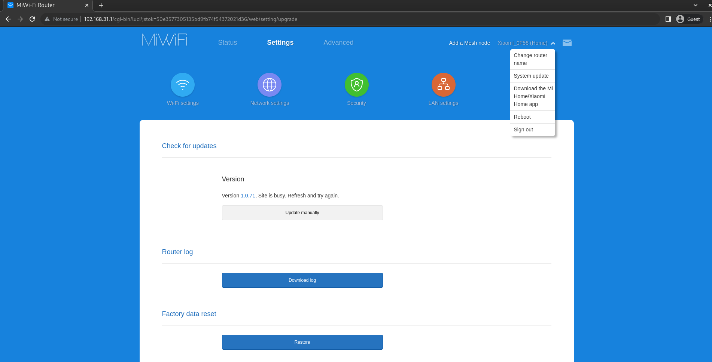
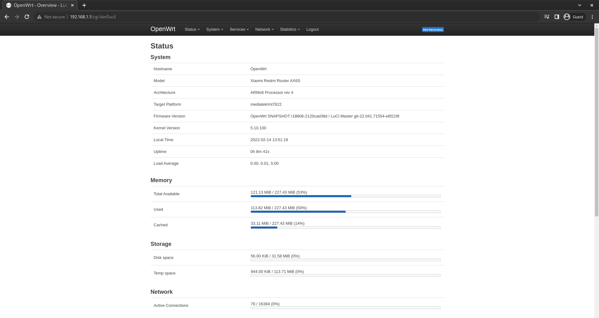

# Xiaomi Router AX6S / AX3200 OpenWRT

[](https://cloud.drone.io/mikeeq/xiaomi_ax3200_openwrt)

## Overview

Scripts for building an OpenWRT image for Xiaomi Router AX6S / AX3200 and tutorial how to install it.

## Tested HW

| Device               | System version        | Model | Production Date | Market |
| -------------------- | --------------------- | ----- | --------------- | ------ |
| Xiaomi Router AX3200 | MiWiFi Release 1.0.71 | RB01  | 09/2021         | EU     |

> Xiaomi AX3200 RB01 EU revision should have Telnet enabled from factory

```bash
# Stock RB01 telnet output
❯ telnet 192.168.31.1
Trying 192.168.31.1...
Connected to 192.168.31.1.
Escape character is '^]'.

XiaoQiang login: root
Password:
```

### Known Issues

- 160Hz wide 5GHz channels don't work on some clients [source](https://forum.openwrt.org/t/adding-openwrt-support-for-xiaomi-redmi-router-ax6s-xiaomi-router-ax3200/111085/131?u=mikeeq)
- Smaller coverage area/WiFi speeds comparing to stock firmware
- I wasn't able to flash OpenWRT on recovered via TFTP AX3200 to 1.0.50 FW, I needed to flash my factory firmware 1.0.71, restore default settings (as they were saved from 1.0.50) and then I was able to flash OpenWRT

## Tutorial: How to install OpenWRT

1. I recommend restoring router settings to factory defaults, before installing OpenWRT

   - Go to `System update` by clicking on your device name in the upper right-hand corner --> Click under `Factory data reset` button `restore`

     

     <!--  -->

2. Finish initial setup by going to <http://192.168.31.1>

3. Check if telnet is enabled on your device

   ```bash
   # Create temporary directory
   mkdir -p xiaomi_openwrt
   cd xiaomi_openwrt

   # Pull scripts for generating telnet password
   curl -L https://raw.githubusercontent.com/mikeeq/xiaomi_ax3200_openwrt/main/script.sh -o ./script.sh
   curl -L https://raw.githubusercontent.com/mikeeq/xiaomi_ax3200_openwrt/main/password.py -o ./password.py

   # Replace <STOK> with the session token grabbed from the login URL after initial setup
   ## http://192.168.31.1/cgi-bin/luci/;stok=1675d313f8c5d384e191b653c44c5e3a/web/home#router
   ### i.e.: STOK="1675d313f8c5d384e191b653c44c5e3a" bash script.sh
   STOK="<STOK>" bash script.sh

   # look for telnet_en=1 or "telnet":true
   ```

   > If `telnet_en=0` or `"telnet": false`, then telnet is not enabled on your device by default and you need to wait for the [exploit](https://forum.openwrt.org/t/adding-openwrt-support-for-xiaomi-redmi-router-ax6s-xiaomi-router-ax3200/111085/74?u=mikeeq) or use [CH341A programmer](https://forum.openwrt.org/t/adding-openwrt-support-for-xiaomi-redmi-router-ax6s-xiaomi-router-ax3200/111085/151?u=mikeeq)
   >> If you're using `RB03` there could be a chance to downgrade your FW to development version and maybe that process will enable the telnet on your device - [info](https://github.com/YangWang92/AX6S-unlock)

   - RB03 1.2.7 dev FW (with telnet enabled) has `MD5: 5eedf1632ac97bb5a6bb072c08603ed7`, `SHA256: 9c80425987fb8d2f8c5f59a7234b795c0990db9147b42f6ad69dc2f76e6a2c11`

4. Start SSHd on router using telnet

   ```bash
   # Create telnet terminal session, use TELNET_PASSWORD from script output from previous point
   telnet 192.168.31.1

   # Enable SSH
   nvram set ssh_en=1
   # Add flags which allow you to recover from bad flashes without going back to the OEM firmware.
   nvram set uart_en=1
   nvram set boot_wait=on
   nvram commit
   sed -i '/flg_ssh.*release/ { :a; N; /fi/! ba };/return 0/d' /etc/init.d/dropbear

   # Set password for root user, `echo -e “<PASSWORD>/n<PASSWORD>” | passwd root` didn't work for me
   passwd root
   # After changing root password it will be persistent change even after restart, so if you'll be trying to telnet after reboot use this password instead of generated one from above

   # Start SSHd (dropbear)
   /etc/init.d/dropbear enable
   /etc/init.d/dropbear start

   # Test SSH connection, for authentication use password set earlier
   ssh root@192.168.31.1
   # cat /proc/mtd
   ```

5. SCP (copy over SSH) OpenWRT images

   ```bash
   # Create temporary directory
   mkdir -p xiaomi_openwrt_images

   # Download images from Internet
   curl -L https://github.com/mikeeq/xiaomi_ax3200_openwrt/releases/download/v20220306/openwrt-mediatek-mt7622-xiaomi_redmi-router-ax6s-squashfs-factory.bin -o xiaomi_openwrt_images/factory.bin

   # Copy images over SSH to router
   scp -r xiaomi_openwrt_images root@192.168.31.1:/tmp/
   ```

6. Validate sha256 checksums and flash OpenWRT

   ```bash
   # Open SSH terminal session
   ssh root@192.168.31.1
   cd /tmp/xiaomi_openwrt_images

   # Validate those checksums against checksums found in github releases file sha256sums_artifacts_only
   sha256sum *.bin

   # Set NVRAM flags
   ## Run also first commented two lines if after flashing sysupgrade.bin image router restarts to stock firmware instead of OpenWRT
   # nvram set flag_boot_rootfs=0
   # nvram set "boot_fw1=run boot_rd_img;bootm"
   nvram set flag_boot_success=1
   nvram set flag_try_sys1_failed=0
   nvram set flag_try_sys2_failed=0
   nvram commit

   # Flash image
   mtd -r write factory.bin firmware
   ```

7. After running last command `mtd write -r` router should automatically reboot and after it gets up you can open <http://192.168.1.1> in the browser and try to login (default password is blank/empty) and set root password here: <http://192.168.1.1/cgi-bin/luci/admin/system/admin>

   > If something went wrong make sure that first you've tried to restart your NIC to grab fresh IP from DHCP and it's from 192.168.1.0/24 subnet range

8. If you're sure that you've bricked your device there's a recovery TFTP mode to [restore stock firmware](#Router-debricking)

## Router debricking

1. Change your NIC IP address to 192.168.31.100 or 192.168.31.50 (that one worked for me and i've only tested the process out on Windows using Xiaomi Recovery Tool)
2. Remember about disabling any firewall on your PC which can block TFTP traffic
3. Create tftp server or use [Xiaomi Recovery Tool](https://forum.openwrt.org/t/xiaomi-mi-router-4a-gigabit-edition-r4ag-r4a-gigabit-fully-supported-and-flashable-with-openwrtinvasion/36685/747?u=mikeeq)

   ```bash
   mkdir -p /tmp/tftp
   # Stock image should be renamed to TFTP server IP address in hex (Eg. C0A81F64.img), 192.168.31.2 - C0A81F02.img, 192.168.31.50 - C0A81F32.img, 192.168.31.100 - C0A81F64.img
   curl -Ls http://cdn.awsde0-fusion.fds.api.mi-img.com/xiaoqiang/rom/rb01/miwifi_rb01_firmware_36352_1.0.50_INT.bin -o C0A81F64.img
   # http://cdn.awsde0-fusion.fds.api.mi-img.com/xiaoqiang/rom/rb01/miwifi_rb01_firmware_bbc77_1.0.71_INT.bin
   # To grab URL for stock firmware check http://192.168.31.1/cgi-bin/luci/;stok=<stok>/api/xqsystem/check_rom_update

   # Check your interface name, in my case it's enp9s0
   ip a

   systemctl stop NetworkManager

   ip address flush dev enp9s0
   ip address add 192.168.31.100/24 dev enp9s0

   dnsmasq --no-daemon --listen-address=192.168.31.100 --bind-interfaces --dhcp-range=192.168.31.2,192.168.31.2 --enable-tftp --tftp-root=/tmp/tftp
   ```

4. Poweroff your device by pulling out power cord from the device
5. Push the reset button and simultaneously put the power cord back on
6. Keep pushing the reset button till Power LED will start fast blinking
7. After successful tftp recovery flash Power LED will start blinking in blue colour, then you can safely restart your router by repluging power cord.
8. If you upgraded to a different version than you were before update to it/to the latest version or at least do a factory reset after initial setup if you know that newest FW blocks some features, i.e.: telnet

### Useful links with debricking information

- Xiaomi Recovery Tool official link: <http://miwifi.com/miwifi_download.html>
- <https://forum.openwrt.org/t/adding-openwrt-support-for-xiaomi-redmi-router-ax6s-xiaomi-router-ax3200/111085/164?u=mikeeq>
- <https://openwrt.org/toh/xiaomi/xiaomi_redmi_router_ac2100#stock_recovery>
- <https://gitlab.com/db260179/openwrt-base/-/tree/master/docker>
- <https://forum.openwrt.org/t/xiaomi-mi-router-4a-gigabit-edition-r4ag-r4a-gigabit-fully-supported-and-flashable-with-openwrtinvasion/36685/747?u=mikeeq>
- <https://openwrt.org/inbox/toh/xiaomi/xiaomi_ax3600#tftp_recovery>

### How to upgrade OpenWRT

> I've tried to flash new sysupgrade image with new partition layout on images provided by thorsten97 (with old partition layout) and I bricked my device, so look out!

```bash
# SSH to OpenWRT flashed router
ssh 192.168.1.1

mkdir -p /tmp/xiaomi_fw
cd /tmp/xiaomi_fw

# Download image
curl -L https://github.com/mikeeq/xiaomi_ax3200_openwrt/releases/download/v20220306/openwrt-mediatek-mt7622-xiaomi_redmi-router-ax6s-squashfs-sysupgrade.bin -o ./sysupgrade.bin

# Validate checksums against checksums found in github releases file sha256sums_artifacts_only
sha256sum *.bin

# Flash image
mtd -r write sysupgrade.bin firmware
```

1. SYSUPGRADE from Luci or via `sysupgrade` CLI command was not tested yet - <https://openwrt.org/docs/guide-user/installation/sysupgrade.cli#command-line_instructions>
2. Restoring default settings was also not tested yet: <https://openwrt.org/docs/guide-user/troubleshooting/failsafe_and_factory_reset#soft_factory_reset>

## Stock /proc/mtd

```bash
root@XiaoQiang:/tmp/xiaomi_openwrt_images# cat /proc/mtd
dev:    size   erasesize  name
mtd0: 00020000 00020000 "PL_Header"
mtd1: 00060000 00020000 "Preloader"
mtd2: 00040000 00020000 "ATF"
mtd3: 00080000 00020000 "uboot"
mtd4: 00040000 00020000 "Nvram"
mtd5: 00040000 00020000 "Bdata"
mtd6: 00080000 00020000 "Factory"
mtd7: 00040000 00020000 "crash"
mtd8: 00040000 00020000 "crash_syslog"
mtd9: 01e00000 00020000 "firmware"
mtd10: 01e00000 00020000 "firmware1"
mtd11: 002a0000 00020000 "kernel"
mtd12: 01b60000 00020000 "rootfs"
mtd13: 03200000 00020000 "overlay"
mtd14: 00500000 00020000 "obr"
```

## OpenWRT /proc/mtd

```bash
root@OpenWrt:/# cat /proc/mtd
dev:    size   erasesize  name
mtd0: 00080000 00020000 "Preloader"
mtd1: 00040000 00020000 "ATF"
mtd2: 00080000 00020000 "u-boot"
mtd3: 00040000 00020000 "u-boot-env"
mtd4: 00040000 00020000 "bdata"
mtd5: 00080000 00020000 "factory"
mtd6: 00040000 00020000 "crash"
mtd7: 00040000 00020000 "crash_log"
mtd8: 07300000 00020000 "firmware"
mtd9: 003a0000 00020000 "kernel"
mtd10: 06f60000 00020000 "rootfs"
mtd11: 06a80000 00020000 "rootfs_data"
```

## Luci Overview



## SSH Output from successfully flashed OpenWRT

```bash
❯ ssh root@192.168.1.1
BusyBox v1.35.0 (2022-03-01 22:57:40 UTC) built-in shell (ash)

  _______                     ________        __
 |     | .-----.-----.-----. |  |  |  | .----. |  | _ |
 | --- ||  _  |  -__|     ||  |  |  ||   _||   _|
 |_______||   __|_____|__|__||________||__|  |____|
          |__| W I R E L E S S   F R E E D O M
 -----------------------------------------------------
 OpenWrt SNAPSHOT, r19039-8235723c78
 -----------------------------------------------------
root@OpenWrt:~# df -h
Filesystem                Size      Used Available Use% Mounted on
/dev/root                 5.0M      5.0M         0 100% /rom
tmpfs                   113.9M    236.0K    113.7M   0% /tmp
tmpfs                   113.9M     72.0K    113.9M   0% /tmp/root
tmpfs                   512.0K         0    512.0K   0% /dev
/dev/mtdblock11         106.5M      2.5M    104.0M   2% /overlay
overlayfs:/overlay      106.5M      2.5M    104.0M   2% /
root@OpenWrt:~# dmesg | grep -i xia
[    0.000000] Machine model: Xiaomi Redmi Router AX6S
```

## Docs

Main:

- <https://forum.openwrt.org/t/adding-openwrt-support-for-xiaomi-redmi-router-ax6s-xiaomi-router-ax3200/111085>
- <https://github.com/openwrt/openwrt/pull/4810/commits/6dc598a880aa79eb2fe5b3e8a04bc23a96256cb2>
- <https://github.com/acecilia/OpenWRTInvasion>
- <https://gitlab.com/db260179/openwrt-base/-/tree/master/docker>
- <https://github.com/robimarko/openwrt/blob/IPQ807x-5.10-backports/.github/workflows/ipq807x.yaml>
- <https://github.com/YangWang92/AX6S-unlock>
- <https://github.com/geekman/xqrepack/>
- <https://forum.openwrt.org/t/xiaomi-ax3600-install-guide/68273>

Additional:

- <https://blog.csdn.net/zhoujiazhao/article/details/102578244>
- <https://openwrt.org/toh/xiaomi/xiaomi_redmi_router_ac2100#stock_recovery>
- <https://openwrt.org/toh/xiaomi/ax3200>
- <https://downloads.openwrt.org/snapshots/targets/mediatek/mt7622/>
- <https://openwrt.org/docs/guide-user/additional-software/imagebuilder>
- <https://openwrt.org/docs/guide-developer/toolchain/use-buildsystem>
- <https://docs.mudfish.net/en/docs/mudfish-cloud-vpn/router-openwrt-install-firmware/>

## Credits

- [@namidairo](https://github.com/namidairo) for adding support for AX3200/AX6S in OpenWRT
- [@thorsten97](https://forum.openwrt.org/u/thorsten97/summary) for building images
