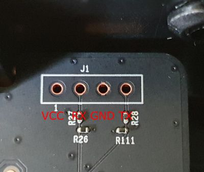
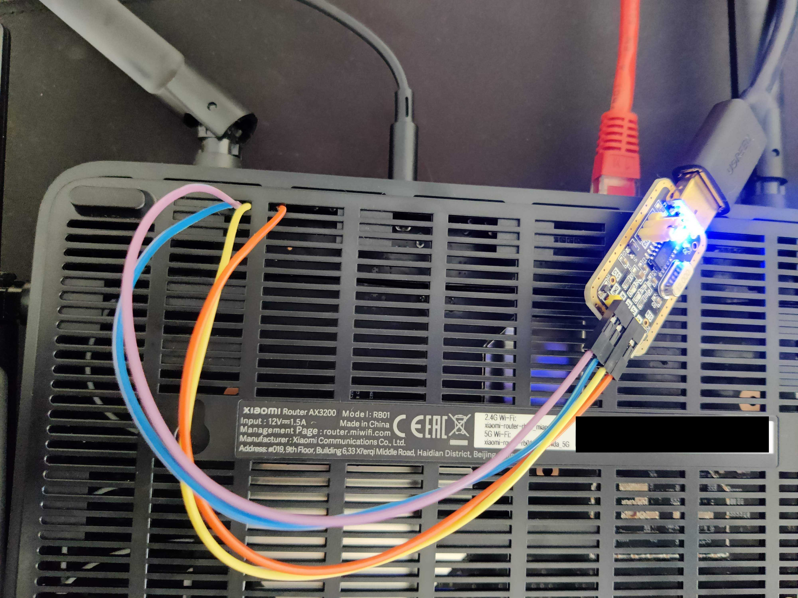

# Xiaomi Router AX6S / AX3200 OpenWRT

[](https://cloud.drone.io/mikeeq/xiaomi_ax3200_openwrt)

## Overview

Scripts for building an OpenWRT image for Xiaomi Router AX6S / AX3200 and a tutorial on how to install it.

## Tested HW

| Device               | System version        | Model | Production Date | Market |
| -------------------- | --------------------- | ----- | --------------- | ------ |
| Xiaomi Router AX3200 | MiWiFi Release 1.0.71 | RB01  | 09/2021         | EU     |

> Xiaomi AX3200 RB01 EU revision with production date earlier than 10/2021 should have Telnet enabled from the factory, 11/2021 and later produced units usually have Telnet disabled

```bash
# Stock RB01 telnet output
❯ telnet 192.168.31.1
Trying 192.168.31.1...
Connected to 192.168.31.1.
Escape character is '^]'.

XiaoQiang login: root
Password:
```

### Known Issues

- 160MHz wide 5GHz channels don't work on some clients [source](https://forum.openwrt.org/t/adding-openwrt-support-for-xiaomi-redmi-router-ax6s-xiaomi-router-ax3200/111085/131?u=mikeeq)
  - <https://github.com/mikeeq/xiaomi_ax3200_openwrt/issues/10#issuecomment-1085959448>
  - to use 160MHz channel change the below settings in 5GHz Wireless Network configuration:
    - in General Setup select channel to: `64`
    - in Advanced Settings change country code from `driver default` to `other`
- Smaller coverage area/WiFi speeds comparing to stock firmware
  - <https://github.com/openwrt/mt76/issues/657#issue-1182664319>

## Tutorial: How to install OpenWRT

0. Please use latest official rc/stable release OpenWRT instead - <https://downloads.openwrt.org/>
   - snapshot builds don't have Luci Web GUI preinstalled
   - if you choose to use a different OpenWRT build than `22.03.0-rc5` please change the URLs in all `curl` commands in the below instructions

1. I recommend restoring router settings to factory defaults, before installing OpenWRT

   - Go to `System update` by clicking on your device name in the upper right-hand corner --> Click under `Factory data reset` button `restore`

     

     <!--  -->

2. Finish initial setup by going to <http://192.168.31.1>

3. Check if telnet is enabled on your device

   ```bash
   # Create temporary directory
   mkdir -p xiaomi_openwrt
   cd xiaomi_openwrt

   # Pull scripts for generating telnet password
   curl -L https://raw.githubusercontent.com/mikeeq/xiaomi_ax3200_openwrt/main/script.sh -o ./script.sh
   curl -L https://raw.githubusercontent.com/mikeeq/xiaomi_ax3200_openwrt/main/password.py -o ./password.py

   # Replace <STOK> with the session token grabbed from the login URL after the initial setup
   ## http://192.168.31.1/cgi-bin/luci/;stok=1675d313f8c5d384e191b653c44c5e3a/web/home#router
   ### i.e.: STOK="1675d313f8c5d384e191b653c44c5e3a" bash script.sh
   STOK="<STOK>" bash script.sh

   # look for telnet_en=1 or "telnet":true
   ```

   > If `telnet_en=0` or `"telnet": false`, then telnet is not enabled on your device by default and you need to use UART to boot `OpenWRT initramfs recovery image`, check tutorial [How to flash OpenWRT using UART](#uart-flash), use [CH341A programmer](https://forum.openwrt.org/t/adding-openwrt-support-for-xiaomi-redmi-router-ax6s-xiaomi-router-ax3200/111085/151?u=mikeeq) or wait for the [exploit](https://forum.openwrt.org/t/adding-openwrt-support-for-xiaomi-redmi-router-ax6s-xiaomi-router-ax3200/111085/74?u=mikeeq)
   >> If you're using `RB03` there could be a chance to downgrade your FW to development version and maybe that process will enable the telnet on your device - <https://github.com/YangWang92/AX6S-unlock>
   - RB03 1.2.7 dev FW (with telnet enabled) `miwifi_rb03_firmware_stable_1.2.7.bin` has `MD5: 5eedf1632ac97bb5a6bb072c08603ed7`, `SHA256: 9c80425987fb8d2f8c5f59a7234b795c0990db9147b42f6ad69dc2f76e6a2c11`
   - RB01 1.0.71 INT FW `miwifi_rb01_firmware_bbc77_1.0.71_INT.bin` has `MD5:271f2faa9ae6123c99ab3493fa3bbc77`, `SHA256:0be39ebd244ea2336a3c1d3d9f279fb21fcbc62b836ed36a40d1af6eba01b65b`

4. Start SSHd on router using telnet

   ```bash
   # Create telnet terminal session, use TELNET_PASSWORD from script output from the previous point
   telnet 192.168.31.1

   # Enable SSH
   nvram set ssh_en=1
   # Add flags which allow you to recover from bad flashes without going back to the OEM firmware.
   nvram set uart_en=1
   nvram set boot_wait=on
   nvram commit
   sed -i '/flg_ssh.*release/ { :a; N; /fi/! ba };/return 0/d' /etc/init.d/dropbear

   # Set password for root user, `echo -e “<PASSWORD>/n<PASSWORD>” | passwd root` didn't work for me
   passwd root
   # After changing root password it will be a persistent change even after restart, so if you'll be trying to telnet after reboot use this password instead of generated one from above

   # Start SSHd (dropbear)
   /etc/init.d/dropbear enable
   /etc/init.d/dropbear start

   # Test SSH connection, for authentication use password set earlier
   ssh root@192.168.31.1
   # cat /proc/mtd
   ```

5. SCP (copy over SSH) OpenWRT images

   ```bash
   # Create temporary directory
   mkdir -p xiaomi_openwrt_images

   # Download images from Internet
   curl -L https://downloads.openwrt.org/releases/22.03.0-rc5/targets/mediatek/mt7622/openwrt-22.03.0-rc5-mediatek-mt7622-xiaomi_redmi-router-ax6s-squashfs-factory.bin -o xiaomi_openwrt_images/factory.bin

   # Copy images over SSH to router
   scp -r xiaomi_openwrt_images root@192.168.31.1:/tmp/
   ```

6. Validate sha256 checksums and flash OpenWRT

   ```bash
   # Open SSH terminal session
   ssh root@192.168.31.1
   cd /tmp/xiaomi_openwrt_images

   # Validate those checksums against checksums found in github releases file sha256sums_artifacts_only
   sha256sum *.bin
   curl -Ls https://downloads.openwrt.org/releases/22.03.0-rc5/targets/mediatek/mt7622/sha256sums | grep -i factory | grep -i xiaomi

   # Set NVRAM flags
   ## Run also first commented two lines if after flashing sysupgrade.bin image router restarts to stock firmware instead of OpenWRT
   # nvram set flag_boot_rootfs=0
   # nvram set "boot_fw1=run boot_rd_img;bootm"
   nvram set flag_boot_success=1
   nvram set flag_try_sys1_failed=0
   nvram set flag_try_sys2_failed=0
   nvram commit

   # Flash image
   mtd -r write factory.bin firmware
   ```

7. After running last command `mtd write -r` router should automatically reboot and after it gets up you can open <http://192.168.1.1> in the browser and try to login (default password is blank/empty) and set root password here: <http://192.168.1.1/cgi-bin/luci/admin/system/admin>

   > If something went wrong make sure that first you've tried to restart your NIC to grab fresh IP from DHCP and it's from 192.168.1.0/24 subnet range

8. If you're sure that you've bricked your device there's a recovery TFTP mode to [restore stock firmware](#Router-debricking)

## UART flash

1. Make sure that you are on RB01 FW 1.0.71 , if not please update using Web Interface [Link](http://cdn.awsde0-fusion.fds.api.mi-img.com/xiaoqiang/rom/rb01/miwifi_rb01_firmware_bbc77_1.0.71_INT.bin)

   - Go to `System update` by clicking on your device name in the upper right-hand corner --> Click under `Check for updates` button `Update manually`
     

2. Restore factory defaults by going to the same WebUI page as previously mentioned:

   - Go to `System update` by clicking on your device name in the upper right-hand corner --> Click under `Factory data reset` button `restore`

3. Connect UART, VCC - 3,3V, remember that RX should go to your UART adapter TX pin, and from device TX to RX on UART adapter

   

4. Check on which TTY your UART device is available: `dmesg`

   ```bash
   dmesg

   [193003.410950] usb 3-4: Product: USB Serial
   [193003.415983] ch341 3-4:1.0: ch341-uart converter detected
   [193003.429995] usb 3-4: ch341-uart converter now attached to ttyUSB0
   ```

5. Open terminal session over serial: `cu -l /dev/ttyUSB0 -s 115200`
6. Flash two times the same firmware over TFTP (check the tutorial underneath)
7. After the second TFTP flash, during boot time you will have an option to boot to U-Boot console (last option), choose that, now you should see terminal prompt `MT7622>`

8. Now switch the TFTP served image to OpenWRT `initramfs-recovery.itb`

   ``` bash
   curl -L https://downloads.openwrt.org/releases/22.03.0-rc5/targets/mediatek/mt7622/openwrt-22.03.0-rc5-mediatek-mt7622-xiaomi_redmi-router-ax6s-initramfs-recovery.itb -o /tmp/tftp/C0A81F64.img

   # Close your previous dnsmasq execution and rerun it
   dnsmasq --no-daemon -i enp9s0 --dhcp-range=192.168.31.1,192.168.31.99 --enable-tftp --tftp-root=/tmp/tftp --dhcp-boot=C0A81F64.img -p0 -K --log-dhcp --bootp-dynamic
   ```

9. Download the recovery image and boot it

   ```bash
   MT7622> tftpboot
   ...
   Filename 'C0A81F64.img'.
   Load address: 0x4007ff28
   ...

   # Execute `boot ${INITRAMFS_ADDRESS}` from tftpboot output and line `Load address: ${INITRAMFS_ADDRESS}`, check the example above
   MT7622> bootm 0x4007ff28
   ```

10. After booting OpenWRT, click Enter to see the terminal prompt, download the image using `scp` from your PC to Xiaomi Router and flash it

    ```bash
    ## On PC
    mkdir -p /tmp/xiaomi_fw
    cd /tmp/xiaomi_fw

    # Download image
    curl -L https://downloads.openwrt.org/releases/22.03.0-rc5/targets/mediatek/mt7622/openwrt-22.03.0-rc5-mediatek-mt7622-xiaomi_redmi-router-ax6s-squashfs-sysupgrade.bin -o ./sysupgrade.bin

    ## Use serial console on router
    mkdir -p /tmp/images
    cd /tmp/images

    # 192.168.1.2 - IP of your PC
    scp 192.168.1.2:/tmp/xiaomi_fw/sysupgrade.bin ./sysupgrade.bin

    # Flash the image using sysupgrade
    sysupgrade sysupgrade.bin

    reboot
    ```

11. If you see in Serial Console output that your router stops booting on U-Boot console, boot manually to OpenWRT and set the flag to boot OpenWRT on startup:

    ```bash
    MT7622> bootmenu
    # Try first or second entry in bootmenu, click enter to boot

    # In OpenWRT set a flag
    fw_setenv boot_fw1 "run boot_rd_img;bootm"

    reboot
    ```

12. If this tutorial wouldn't work for you, check these links:

    - <https://forum.openwrt.org/t/adding-openwrt-support-for-xiaomi-redmi-router-ax6s-xiaomi-router-ax3200/111085/513>
    - <https://forum.openwrt.org/t/adding-openwrt-support-for-xiaomi-redmi-router-ax6s-xiaomi-router-ax3200/111085/583>

## Router debricking

1. Change your NIC IP address to 192.168.31.100
2. Remember to disable any firewall on your PC which can block TFTP traffic
3. Create tftp server or use [Xiaomi Recovery Tool](https://forum.openwrt.org/t/xiaomi-mi-router-4a-gigabit-edition-r4ag-r4a-gigabit-fully-supported-and-flashable-with-openwrtinvasion/36685/747?u=mikeeq)

   ```bash
   mkdir -p /tmp/tftp
   # Stock image should be renamed to TFTP server IP address in hex (Eg. C0A81F64.img), 192.168.31.2 - C0A81F02.img, 192.168.31.50 - C0A81F32.img, 192.168.31.100 - C0A81F64.img
   curl -Ls http://cdn.awsde0-fusion.fds.api.mi-img.com/xiaoqiang/rom/rb01/miwifi_rb01_firmware_bbc77_1.0.71_INT.bin -o C0A81F64.img
   # http://cdn.awsde0-fusion.fds.api.mi-img.com/xiaoqiang/rom/rb01/miwifi_rb01_firmware_36352_1.0.50_INT.bin
   # To grab URL for stock firmware check http://192.168.31.1/cgi-bin/luci/;stok=<stok>/api/xqsystem/check_rom_update

   # Check your interface name, in my case it's enp9s0
   ip a

   systemctl stop NetworkManager
   systemctl stop firewalld
   systemctl stop systemd-resolved.service

   # Check if there's no iptables rules which could block dhcp/tftp traffic (UDP 67, UDP 69)
   iptables -L
   # Check if there are no services running on dhcp/tftp ports (UDP 67, UDP 69)
   netstat -tulpn

   ip address flush dev enp9s0
   ip address add 192.168.31.100/24 dev enp9s0

   dnsmasq --no-daemon -i enp9s0 --dhcp-range=192.168.31.1,192.168.31.99 --enable-tftp --tftp-root=/tmp/tftp --dhcp-boot=C0A81F64.img -p0 -K --log-dhcp --bootp-dynamic
   ```

4. Power off your device by pulling out power cord from the device
5. Push the reset button, keep pushing it for 10 seconds and simultaneously put the power cord back on
6. Release the reset button when Power LED will start fast blinking
7. After successful tftp recovery flash Power LED will start blinking in blue colour, then you can safely restart your router by replugging the power cord.
8. If you upgraded to a different version than you were before update to that specific version, to the latest version or at least do a factory reset after the initial setup if you know that the newest Firmware blocks some features, i.e.: telnet

### Useful links with debricking information

- Xiaomi Recovery Tool official link: <http://miwifi.com/miwifi_download.html>
- <https://forum.openwrt.org/t/adding-openwrt-support-for-xiaomi-redmi-router-ax6s-xiaomi-router-ax3200/111085/164?u=mikeeq>
- <https://openwrt.org/toh/xiaomi/xiaomi_redmi_router_ac2100#stock_recovery>
- <https://gitlab.com/db260179/openwrt-base/-/tree/master/docker>
- <https://forum.openwrt.org/t/xiaomi-mi-router-4a-gigabit-edition-r4ag-r4a-gigabit-fully-supported-and-flashable-with-openwrtinvasion/36685/747?u=mikeeq>
- <https://openwrt.org/inbox/toh/xiaomi/xiaomi_ax3600#tftp_recovery>

### How to upgrade OpenWRT

> I've tried to flash a new sysupgrade image with new partition layout on images provided by thorsten97 (with the old partition layout) and I bricked my device, so look out!

```bash
# SSH to OpenWRT flashed router
ssh 192.168.1.1

mkdir -p /tmp/xiaomi_fw
cd /tmp/xiaomi_fw

# Download image
curl -L https://downloads.openwrt.org/releases/22.03.0-rc5/targets/mediatek/mt7622/openwrt-22.03.0-rc5-mediatek-mt7622-xiaomi_redmi-router-ax6s-squashfs-sysupgrade.bin -o ./sysupgrade.bin

# Validate checksums against checksums found in github releases file sha256sums_artifacts_only
sha256sum *.bin
curl -Ls https://downloads.openwrt.org/releases/22.03.0-rc5/targets/mediatek/mt7622/sha256sums | grep -i sysupgrade | grep -i xiaomi

# Flash image
## If you are coming from other partition layout (check changelog) use mtd flash command instead of sysupgrade from tutorial above (and you will also need to download another image (factory.bin in this case))

## If you want to keep configuration
sysupgrade -u sysupgrade.bin
## If you want to restore default settings
sysupgrade -u -n sysupgrade.bin
## You can also use sysupgrade feature in Luci if you're not upgrading from an image with different partition layout
### You can safely upgrade your OpenWRT using official release if you already are on the latest release from this project
```

### How to fix OPKG package installation

If OPKG fails due to DNS resolution errors you need to add DNS server configuration to internal bridge interface:

```bash
# example error
root@OpenWrt:~# opkg update
Downloading https://downloads.openwrt.org/snapshots/targets/mediatek/mt7622/packages/Packages.gz
Failed to send request: Operation not permitted
*** Failed to download the package list from https://downloads.openwrt.org/snapshots/targets/mediatek/mt7622/packages/Packages.gz
```

In luci go to `interfaces --> interface edit --> advanced settings --> Use custom DNS servers --> Add a custom DNS here`

or in cli
```bash
# /etc/config/network
config interface 'lan'
        option device 'br-lan'
        list dns '8.8.8.8'
```

## Stock /proc/mtd

```bash
root@XiaoQiang:/tmp/xiaomi_openwrt_images# cat /proc/mtd
dev:    size   erasesize  name
mtd0: 00020000 00020000 "PL_Header"
mtd1: 00060000 00020000 "Preloader"
mtd2: 00040000 00020000 "ATF"
mtd3: 00080000 00020000 "uboot"
mtd4: 00040000 00020000 "Nvram"
mtd5: 00040000 00020000 "Bdata"
mtd6: 00080000 00020000 "Factory"
mtd7: 00040000 00020000 "crash"
mtd8: 00040000 00020000 "crash_syslog"
mtd9: 01e00000 00020000 "firmware"
mtd10: 01e00000 00020000 "firmware1"
mtd11: 002a0000 00020000 "kernel"
mtd12: 01b60000 00020000 "rootfs"
mtd13: 03200000 00020000 "overlay"
mtd14: 00500000 00020000 "obr"
```

## OpenWRT /proc/mtd

```bash
root@OpenWrt:~# cat /proc/mtd
dev:    size   erasesize  name
mtd0: 00080000 00020000 "Preloader"
mtd1: 00040000 00020000 "ATF"
mtd2: 00080000 00020000 "u-boot"
mtd3: 00040000 00020000 "u-boot-env"
mtd4: 00040000 00020000 "bdata"
mtd5: 00080000 00020000 "factory"
mtd6: 00040000 00020000 "crash"
mtd7: 00040000 00020000 "crash_log"
mtd8: 00400000 00020000 "kernel"
mtd9: 06f00000 00020000 "ubi"
```

## Luci Overview


## SSH Output from successfully flashed OpenWRT

```bash
❯ ssh root@192.168.1.1
BusyBox v1.35.0 (2022-03-05 20:06:35 UTC) built-in shell (ash)

  _______                     ________        __
 |       |.-----.-----.-----.|  |  |  |.----.|  |_
 |   -   ||  _  |  -__|     ||  |  |  ||   _||   _|
 |_______||   __|_____|__|__||________||__|  |____|
          |__| W I R E L E S S   F R E E D O M
 -----------------------------------------------------
 OpenWrt SNAPSHOT, r19053-921392e216
 -----------------------------------------------------
root@OpenWrt:~# df -h
Filesystem                Size      Used Available Use% Mounted on
/dev/root                 5.8M      5.8M         0 100% /rom
tmpfs                   113.9M    244.0K    113.7M   0% /tmp
/dev/ubi0_1              89.7M     44.0K     85.0M   0% /overlay
overlayfs:/overlay       89.7M     44.0K     85.0M   0% /
tmpfs                   512.0K         0    512.0K   0% /dev
root@OpenWrt:~# dmesg | grep -i xia
[    0.000000] Machine model: Xiaomi Redmi Router AX6S
root@OpenWrt:~# dmesg | grep -i mikeeq
[    0.000000] Linux version 5.10.103 (mikeeq@08bd2e1-droneci) (aarch64-openwrt-linux-musl-gcc (OpenWrt GCC 11.2.0 r19053-921392e216) 11.2.0, GNU ld (GNU Binutils) 2.37) #0 SMP Sat Mar 5 20:06:35 2022
```

## Docs

Main:

- <https://forum.openwrt.org/t/adding-openwrt-support-for-xiaomi-redmi-router-ax6s-xiaomi-router-ax3200/111085>
- <https://github.com/openwrt/openwrt/pull/4810/commits/6dc598a880aa79eb2fe5b3e8a04bc23a96256cb2>
- <https://github.com/acecilia/OpenWRTInvasion>
- <https://gitlab.com/db260179/openwrt-base/-/tree/master/docker>
- <https://github.com/robimarko/openwrt/blob/IPQ807x-5.10-backports/.github/workflows/ipq807x.yaml>
- <https://github.com/YangWang92/AX6S-unlock>
- <https://github.com/geekman/xqrepack/>
- <https://forum.openwrt.org/t/xiaomi-ax3600-install-guide/68273>

Additional:

- <https://blog.csdn.net/zhoujiazhao/article/details/102578244>
- <https://openwrt.org/toh/xiaomi/xiaomi_redmi_router_ac2100#stock_recovery>
- <https://openwrt.org/toh/xiaomi/ax3200>
- <https://downloads.openwrt.org/snapshots/targets/mediatek/mt7622/>
- <https://openwrt.org/docs/guide-user/additional-software/imagebuilder>
- <https://openwrt.org/docs/guide-developer/toolchain/use-buildsystem>
- <https://docs.mudfish.net/en/docs/mudfish-cloud-vpn/router-openwrt-install-firmware/>

## Credits

- [@namidairo](https://github.com/namidairo) for adding support for AX3200/AX6S in OpenWRT
- [@thorsten97](https://forum.openwrt.org/u/thorsten97/summary) for building images
